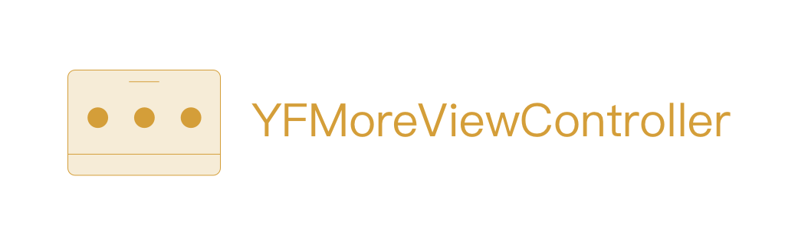
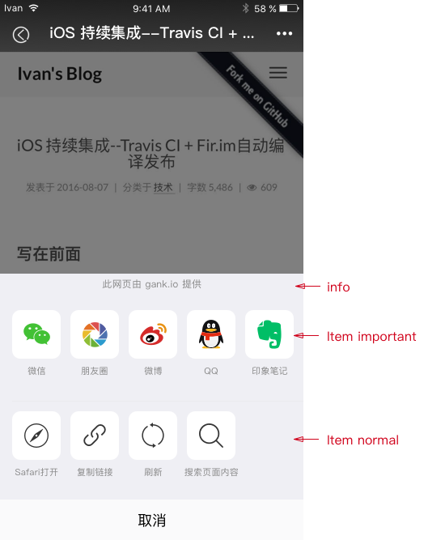

# YFMoreViewController

<p>
<a href="http://cocoadocs.org/docsets/YFMoreViewController"></a>
<a href="https://github.com/yeziahehe/YFMoreViewController/blob/master/LICENSE"></a>
<a href="http://swift.org"></a>
<a href="https://developer.apple.com/xcode/"></a>
<a href="https://developer.apple.com/ios"></a>
</p>

Swift 编写的更多操作 ViewController。

# 介绍

仿照微信更多操作，用来分享、网页操作等。你可以使用 YFMoreViewController 只进行分享或者操作网页。

# 要求

- iOS 10 及以后 (我没有在 iOS 1O 以下系统 Run，如果你发现问题，请 Open an issue)
- Xcode 9.x 及以后
- Swift 4.x 及以后(Swift 3.x, 使用版本 1.0.2)

# 安装

## CocoaPods

- 添加如下到 `Podfile`:
```
pod 'YFMoreViewController'
```
- Run `pod install`。
- 导入 `import YFMoreViewController` 在任何你需要的地方。

## Manually

- 添加 Sources 文件夹中的三个文件 `YFMoreItemView`、`YFMoreViewDelegate`、`YFMoreViewController` 到项目中。
- 导入 `import YFMoreViewController` 在任何你需要的地方。

# 用法

## 基本概念



YFMoreViewController 由三个部分组成：info, item important 和 item normal。这三个部分可以都为空，那么只剩下取消按钮，显然是不美观实用。

- info: 如果你在 WebView 中使用 YFMoreViewController，你可以在这里显示“此网页由 xxx 提供”。

- item important: 主要展示第三方分享平台，类似于微信、朋友圈等。你可以只使用 item important 这一部分，可以替代你的分享页面。

- item normal: 主要展示基础操作，可以配合 WebView 使用或者你其他需要使用的场景。

## 基本用法

初始化 YFMoreViewController, 然后添加 items 并展示。
```
let moreViewController = YFMoreViewController.init()
moreViewController.delegate = self

moreViewController.addInfo("Powered By yeziahehe.com")
moreViewController.addItems(title: "Wechat", image: UIImage(named: "wechat"), type: .important, tag: "wechat")
moreViewController.addItems(title: "Open With Safari", image: UIImage(named: "safari"), type: .normal, tag:"safari")

moreViewController.showFromBottom()
```

接下来实现协议方法。
```
func moreView(_ moreview: YFMoreViewController, didSelectItemAt tag: String, type: YFMoreItemType) {
  switch tag {
  case "wechat":
      return
  case "safari":
      UIApplication.shared.open(URL(string: "http://yeziahehe.com")!, options: [:], completionHandler: nil)
      print("safari")
      return
  }
}
```

# 关于

- [博客](http://yeziahehe.com/)
- 邮箱: yeziahehe@gmail.com

# License

YFMoreViewController is available under the MIT license. See the [LICENSE file](https://github.com/yeziahehe/YFMoreViewController/blob/master/LICENSE) for more info.
